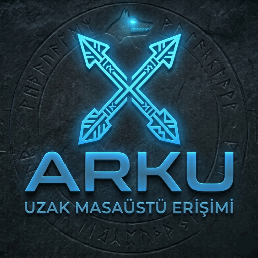

<div align="center">

</div>

# Arku Remote

**Güvenli P2P Uzak Masaüstü Uygulaması** — Görüntü ve veri doğrudan iki cihaz arasında, uçtan uca şifreli. Açık kaynak.

[arku-remote-website.vercel.app](https://arku-remote-website.vercel.app) · [Web'de Dene](https://arku-remote.vercel.app) · [Releases](https://github.com/boukalemoon/arku-remote/releases)

---

## Özellikler

- **P2P Bağlantı** — Ekran, ses, dosya ve girdi WebRTC ile doğrudan iki cihaz
  arasında akar; sunucuya hiç uğramaz. Sunucu yalnızca iki cihazın birbirini
  bulmasına yeten üstveriyi taşır (sinyalleşme) ve kısıtlı ağlarda trafiği
  şifreli olarak aktarır (TURN relay).
- **Uçtan Uca Şifreleme** — DTLS-SRTP; anahtar değişimi uçlar arasında yapılır,
  sunucu anahtarları görmez.
- **Bağlantı Doğrulama** — İki ekranda gösterilen altı karakterlik kod, araya
  giren birini ortaya çıkarır.
- **Oturum Parolası** — Kimliği bilmek tek başına bağlanmaya yetmez.
- **Denetim İzi** — Oturum, izin ve rıza olayları değiştirilemez bir hash
  zincirine yazılır.
- **Çapraz Platform** — Windows, macOS, Linux ve tarayıcı desteği
- **Açık Kaynak** — MIT lisansı

## Kurulum

[Releases](https://github.com/boukalemoon/arku-remote/releases) sayfasından platformunuza uygun dosyayı indirin:

| Platform | Dosya |
|----------|-------|
| Windows  | `Arku-Remote-Setup.exe` |
| macOS    | `Arku-Remote.dmg` |
| Linux    | `Arku-Remote.AppImage` |

## Geliştirme Ortamı

**Gereksinimler:** Node.js 20+

```bash
# Bağımlılıkları yükle
npm install

# .env.local dosyası oluştur
cp .env.example .env.local
# VITE_SUPABASE_URL ve VITE_SUPABASE_ANON_KEY değerlerini doldur

# Web uygulamasını başlat
npm run dev

# Electron uygulamasını başlat
npm run desktop:dev
```

## Yapı

```
src/          — React uygulaması
electron/     — Electron ana süreç
website/      — Landing page (statik HTML)
```

## Güvenlik ve KVKK

- Güvenlik açığı bildirimi: [SECURITY.md](SECURITY.md)
- İşlenen veriler, saklama süreleri ve kararların gerekçesi: [KVKK.md](KVKK.md)
- Yayına alma, migration sırası ve panel ayarları: [DEPLOYMENT.md](DEPLOYMENT.md)
- TURN relay kurulumu: [TURN_SETUP.md](TURN_SETUP.md)

---

**TrendTech** tarafından geliştirildi.
